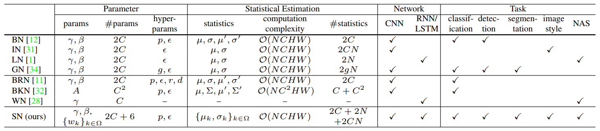
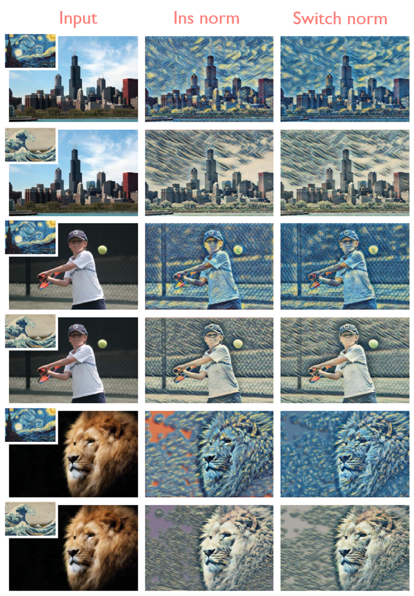

# Switchable_Normalization-Tensorflow
Simple Tensorflow implementation of [Switchable Normalization](https://arxiv.org/abs/1806.10779)

## Summary


## Code
```python
def switch_norm(x, scope='switch_norm') :
    with tf.variable_scope(scope) :
        ch = x.shape[-1]
        eps = 1e-5

        batch_mean, batch_var = tf.nn.moments(x, [0, 1, 2], keep_dims=True)
        ins_mean, ins_var = tf.nn.moments(x, [1, 2], keep_dims=True)
        layer_mean, layer_var = tf.nn.moments(x, [1, 2, 3], keep_dims=True)

        gamma = tf.get_variable("gamma", [ch], initializer=tf.constant_initializer(1.0))
        beta = tf.get_variable("beta", [ch], initializer=tf.constant_initializer(0.0))

        mean_weight = tf.nn.softmax(tf.get_variable("mean_weight", [3], initializer=tf.constant_initializer(1.0)))
        var_wegiht = tf.nn.softmax(tf.get_variable("var_weight", [3], initializer=tf.constant_initializer(1.0)))

        mean = mean_weight[0] * batch_mean + mean_weight[1] * ins_mean + mean_weight[2] * layer_mean
        var = var_wegiht[0] * batch_var + var_wegiht[1] * ins_var + var_wegiht[2] * layer_var

        x = (x - mean) / (tf.sqrt(var + eps))
        x = x * gamma + beta

        return x
```

## Usage
```python
with tf.variable_scope('network') :
    x = conv(x, scope='conv_0')
    x = switch_norm(x, scope='switch_norm_0')
    x = relu(x)
```

## Results
### Comparison


### Style Transfer


## Related works
* [Batch_Instance_Normalization](https://github.com/taki0112/Batch_Instance_Normalization-Tensorflow)

## Author
Junho Kim
